# Базовая настройка коммутатора
### Исходные данные
#### Топология


#### Таблица адресации

|Устройство|Интерфейс|IP-адрес / префикс|
|----------|---------|------------------|
| S1 | VLAN 1 | 192.168.1.2/24 |
| PC-A | NIC | 192.168.1.10/24 |

### Задачи
1. Проверка конфигурации коммутатора по умолчанию
2. Создание сети и настройка основных параметров устройства
    - Настроить базовые параметры коммутатора
    - Настроить IP-адрес для ПК
3. Проверка сетевых подключений
    - Отобразить конфигурацию устройства
    - Протестировать сквозное соединение, отправив эхо-запрос
    - Протестировать возможности удалённого управления с помощью Telnet

### Создание сети и проверка настроек коммутатора по умолчанию
Подключим компьютер к коммутатору консольным кабелем

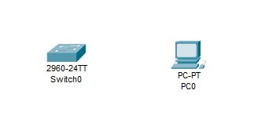

Подключимся к коммутатору через терминал

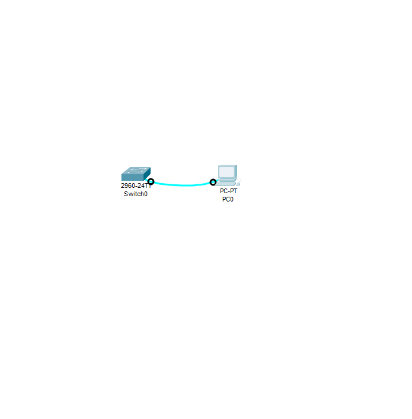

> **Q: Почему нужно использовать консольное подключение для первоначальной настройки коммутатора? Почему нельзя подключиться к коммутатору через Telnet или SSH?**
>
> **A:**  На данном этапе в коммутаторе отсутствует конфигурация позволяющая подключиться к нему другим способом.

На чистом коммутаторе 2960 вывод команды `show running-config` имеет следующий вид:
```
!
version 15.0
no service timestamps log datetime msec
no service timestamps debug datetime msec
no service password-encryption
!
hostname Switch
!
!
!
!
!
!
spanning-tree mode pvst
spanning-tree extend system-id
!
interface FastEthernet0/1
!
interface FastEthernet0/2
!
interface FastEthernet0/3
!
interface FastEthernet0/4
!
interface FastEthernet0/5
!
interface FastEthernet0/6
!
interface FastEthernet0/7
!
interface FastEthernet0/8
!
interface FastEthernet0/9
!
interface FastEthernet0/10
!
interface FastEthernet0/11
!
interface FastEthernet0/12
!
interface FastEthernet0/13
!
interface FastEthernet0/14
!
interface FastEthernet0/15
!
interface FastEthernet0/16
!
interface FastEthernet0/17
!
interface FastEthernet0/18
!
interface FastEthernet0/19
!
interface FastEthernet0/20
!
interface FastEthernet0/21
!
interface FastEthernet0/22
!
interface FastEthernet0/23
!
interface FastEthernet0/24
!
interface GigabitEthernet0/1
!
interface GigabitEthernet0/2
!
interface Vlan1
 no ip address
 shutdown
!
!
!
!
line con 0
!
line vty 0 4
 login
line vty 5 15
 login
!
!
!
!
end
```

> **Q: Сколько интерфейсов FastEthernet имеется на коммутаторе 2960?**
> 
> **A:** Коммутатор имеет 24 интерфейсов FastEthernet

> **Q: Сколько интерфейсов GigabitEthernet имеется на коммутаторе 2960?**
>
> **A:** Коммутатор имеет 2 интерфейсов GigabitEthernet

> **Q: Каков диапазон значений, отображаемых в vty-линиях?**
> 
> **A:** В конфигурации указаны диапазоны от 0 до 4 и от 5 до 15

При попытке вывести файл загрузочной конфигурации командой `show startup-config` коммутатор сообщает *startup-config is not present*. Данное сообщение буквально говорит нам что файла содержащего стартовую конфигурацию не найдено.


Убедиться что такого файла нет можно просмотрев содержимое флеш-памяти командой `show flash`. Мы видим что в памяти коммутатора находится только образ системы Cisco IOS.

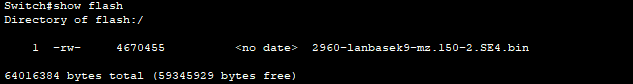

Дополнительную информацию о коммутаторе можно узнать выполнив команду `show version`. В выводе команды можно увидеть сколько времени работает коммутатор и путь к загрузочному образу

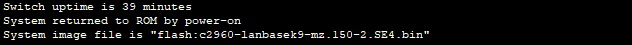

> **Q: Под управлением какой версии ОС Cisco IOS работает коммутатор?**
> 
> **A:** Версия программного обеспечения: *15.0(2)SE4*

> **Q: Как называется файл образа системы?**
> 
> **A:** Название образа системы Cisco IOS: *2960-lanbasek9-mz.150-2.SE4.bin*


А также информацию о самом коммутаторе

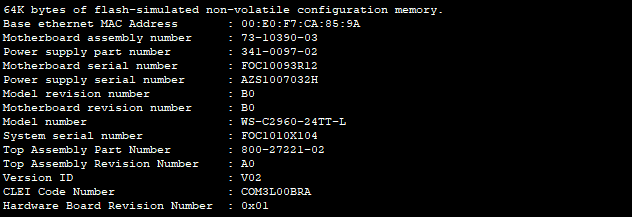

С завода коммутатор имеет один SVI для VLAN 1, однако он не настроен и выключен. Выполним команду `show interface vlan 1` и посмотрим на свойства интерфейса.

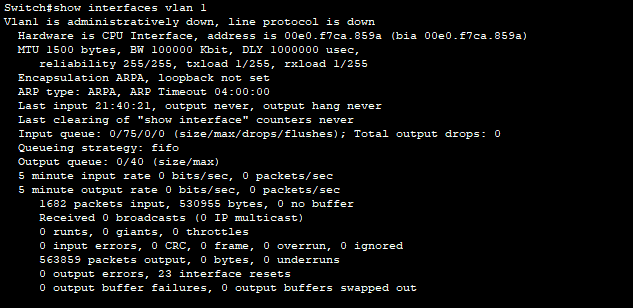

> **Q: Назначен ли IP-адрес сети VLAN 1?**
> 
> **A:** Нет. Не назначен.

> **Q: Какой MAC-адрес имеет SVI?**
> 
> **A:** MAC-адрес интерфейса: *00e0.f7ca.859a*

> **Q: Данный интерфейс включен?**
> 
> **A:** Нет. Данный интерфейс выключен.

IP-свойства интерфейса отображаются командой `show ip interface vlan 1` и отображают лишь то что интерфейс выключен.

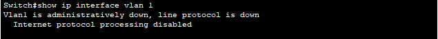

Выполним подключение компьютера к порту 6 на коммутаторе кабелем Ethernet. В момент подключения в консоли коммутатора наблюдаем сообщения что интерфейс *FastEthernet0/6* изменил своё состояние и перешёл в состояние *UP*

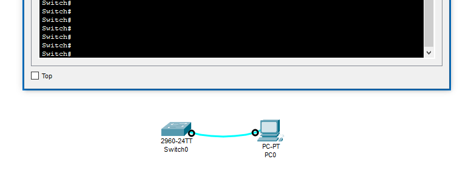

Изучим текущее состояние подключенного интерфейса командой `show interfaces fastEthernet 0/6`.

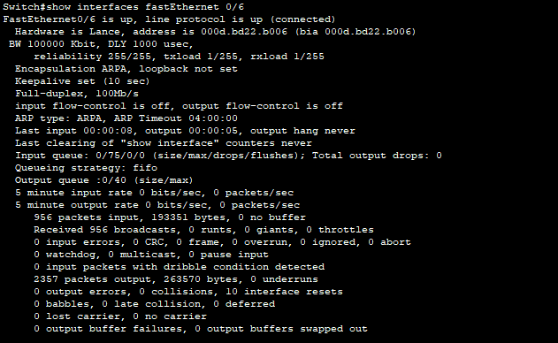

> **Q: Интерфейс включен или выключен?**
> 
> **A:** Интерфейс включен

> **Q: Что нужно сделать, чтобы включить интерфейс?**
> 
> **A:** В случае если по умолчанию интерфейс выключен, то необходимо зайти в конфигурацию интерфейса и выполнить команду `no shutdown`
> ```
> Switch#configure terminal
> Switch(config)#interface fastEthernet 0/6
> Switch(config-if)#no shutdown
> ```

> **Q: Какой MAC-адрес у интерфейса?**
> 
> **A:** MAC-адрес интерфейса: 000d.bd22.b006

> **Q: Какие настройки скорости и дуплекса заданы в интерфейсе?**
> 
> **A:** На интерфейсе настроен Full-duplex, 100Mb/s

### Настройка базовых параметров сетевых устройств
#### Настройка коммутатора 
Перейдём в режим глобальной конфигурации и выполним настройку базовых параметров командами:
```
no ip domain-lookup
hostname S1
service password-encryption
enable secret class
banner motd #
Unauthorized access is strictly prohibited. #
```

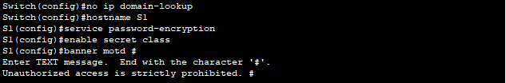

Назначим SVI интерфейсу коммутатора IP-адрес чтобы в дальнейшем удалённо подключаться к коммутатору. Сделаем это для интерфейса VLAN 1, адрес возьмём из таблицы адресации. Выполним настройку:
```
configure terminal
interface vlan 1
ip address 192.168.1.2 255.255.255.0
no shutdown
```
После выполнения последней команды видим что интерфейс изменил своё состояние и перешёл в состояние UP

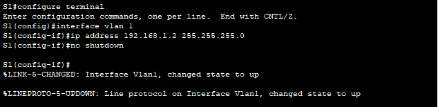

Настроим доступ через Telnet. Для этого зададим пароль и разрешим использовать telnet для подключения. Пароль *class*

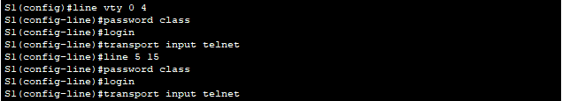

Защитим доступ к консоли паролем. Пароль *cisco*


И выключим вывод сообщений в консоль чтобы не мешали


#### Настроим компьютер
Выполним настройку IP-адреса компьютер, адрес возьмём из таблицы адресации

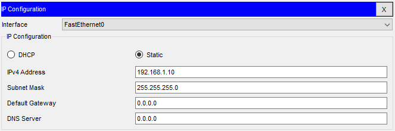

### Проверка сетевых подключений
#### Конфигурация коммутатора
```
!
version 15.0
no service timestamps log datetime msec
no service timestamps debug datetime msec
service password-encryption
!
hostname S1
!
enable secret 5 $1$mERr$9cTjUIEqNGurQiFU.ZeCi1
!
!
!
no ip domain-lookup
!
!
!
spanning-tree mode pvst
spanning-tree extend system-id
!
interface FastEthernet0/1
!
interface FastEthernet0/2
!
interface FastEthernet0/3
!
interface FastEthernet0/4
!
interface FastEthernet0/5
!
interface FastEthernet0/6
!
interface FastEthernet0/7
!
interface FastEthernet0/8
!
interface FastEthernet0/9
!
interface FastEthernet0/10
!
interface FastEthernet0/11
!
interface FastEthernet0/12
!
interface FastEthernet0/13
!
interface FastEthernet0/14
!
interface FastEthernet0/15
!
interface FastEthernet0/16
!
interface FastEthernet0/17
!
interface FastEthernet0/18
!
interface FastEthernet0/19
!
interface FastEthernet0/20
!
interface FastEthernet0/21
!
interface FastEthernet0/22
!
interface FastEthernet0/23
!
interface FastEthernet0/24
!
interface GigabitEthernet0/1
!
interface GigabitEthernet0/2
!
interface Vlan1
 ip address 192.168.1.2 255.255.255.0
!
banner motd ^C
Unauthorized access is strictly prohibited. ^C
!
!
!
line con 0
 password 7 0822455D0A16
 logging synchronous
 login
!
line vty 0 4
 password 7 0822404F1A0A
 login
 transport input telnet
line vty 5 14
 password 7 0822404F1A0A
 login
 transport input telnet
line vty 15
 login
!
!
!
!
end
```
> **Q: **
> 
> **A:** 

> **Q: **
> 
> **A:** 

> **Q: **
> 
> **A:** 