# Настройка IPv6-адресов на сетевых устройствах
## Исходные данные
### Топология


### Таблица адресации
| Устройство | Интерфейс | IPv6-адрес         | Link-local IPv6-адрес | Длина префикса | Шлюз по умолчанию |
|------------|-----------|--------------------|-----------------------|----------------|-------------------|
| R1         | G0/0/0    | 2001:db8:acad:a::1 | fe80::1               | 64             | -                 |
| R1         | G0/0/1    | 2001:db8:acad:1::1 | fe80::1               | 64             | -                 |
| S1         | VLAN 1    | 2001:db8:acad:1::b | fe80::b               | 64             | -                 |
| PC-A       | NIC       | 2001:db8:acad:1::3 | SLAAC                 | 64             | fe80::1           |
| PC-B       | NIC       | 2001:db8:acad:a::3 | SLAAC                 | 64             | fe80::1           |

## Задачи
1. Настройка топологии и конфигурация основных параметров маршрутизатора и коммутатора
2. Ручная настройка IPv6-адресов
3. Проверка сквозного соединения

## Настройка топологии и конфигурация основных параметров маршрутизатора и коммутатора
Строим топологию

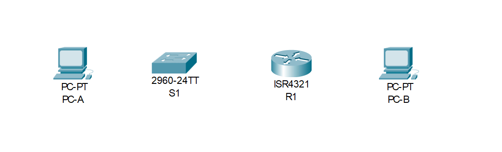

И выполняем базовую настройку устройств. Задаём пароли и имена устройств. Пример для коммутатора (в режиме глобальной конфигурации):

```
no ip domain-lookup
hostname S1
!
line console 0
 password cisco
 login
!
line vty 0 15
 password class
 login
!
enable secret class
!
service password-encryption
```

Для коммутатора также включаем IPv6-адресацию, после выполнения команды не забываем перезагрузиться

```
sdm prefer dual-ipv4-and-ipv6 default
```

## Ручная настройка IPv6-адресов
### Настройка адресов интерфейсам R1
Настраиваем адреса маршрутизатору **R1** согласно таблице в начале

```
interface GigabitEthernet0/0/0
 ipv6 address FE80::1 link-local
 ipv6 address 2001:DB8:ACAD:A::1/64
 no shutdown
!
interface GigabitEthernet0/0/1
 ipv6 address FE80::1 link-local
 ipv6 address 2001:DB8:ACAD:1::1/64
 no shutdown
!
```

Проверим настроенные адреса командой `show ipv6 interface brief`

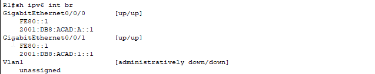

**Q: Какие группы многоадресной рассылки назначены интерфейсу G0/0?**

**A:** Посмотреть данную информацию можно командой `show ipv6 interface gigabitEthernet 0/0/0`. Получаем что интерфейсу назначены группы:

- `FF02::1` - группа многоадресной рассылки для всех узлов
- `FF02::1:FF00:1` - группа запрашиваемых узлов

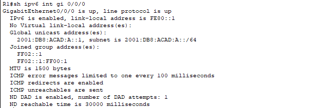

### Активация IPv6-маршрутизации на R1
По умолчанию маршрутизация на роутере **R1** выключена поэтому на подключенном ПК **PC-B** при просмотре назначенных адресов мы увидим только link-local адрес. Предварительно на ПК надо включить автоматическое конфигурирование IPv6

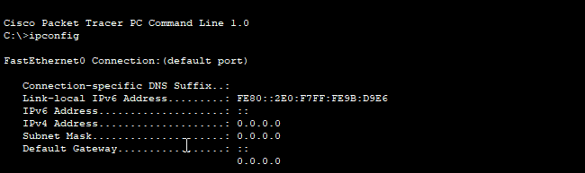

Активируем маршрутизацию IPv6 на роутере командой `ipv6 unicast-routing` и снова проверим на **PC-B** назначенные адреса. Видим что ПК сконфигурировал адреса при помощи SLAAC

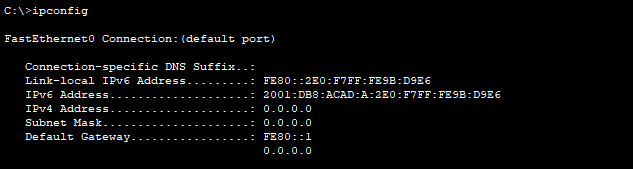

### Назначение IPv6-адреса интерфейсу управления на S1
Настраиваем адреса коммутатору **S1** согласно таблице в начале

```
interface vlan 1
 ipv6 address FE80::B link-local
 ipv6 address 2001:DB8:ACAD:1::B/64
 no shutdown
```

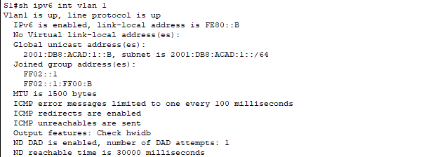

### Назначение компьютерам статических IPv6-адресов
Назначим адреса ПК и шлюза согласно таблице в начале

**PC-A**:

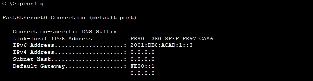

**PC-B**:

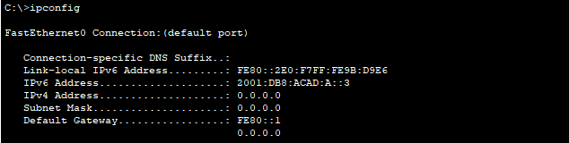

## Проверка сквозного соединения
Эхо запрос c **PC-A** на link-local адрес **R1** - **fe80::1**

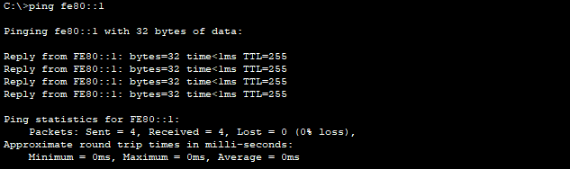

Эхо запрос на интерфейс управления коммутатором - **2001:db8:acad:1::b**

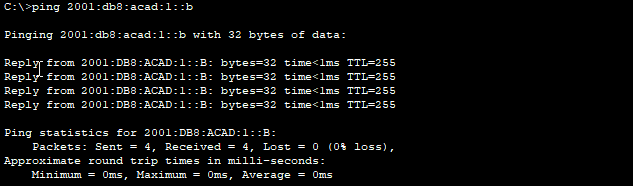

`tracert` c **PC-A** на **PC-B**

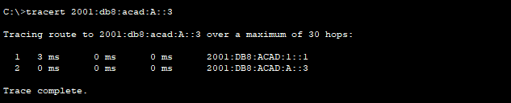

Эхо запрос с **PC-B** на **PC-A**

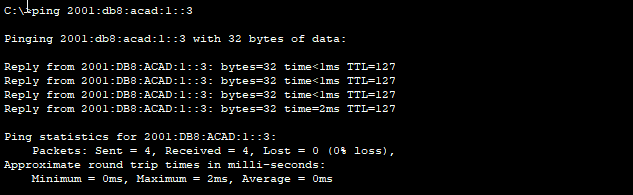

Эхо запрос c **PC-B** на link-local адрес **R1** - **fe80::1**

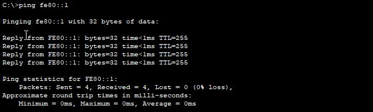

## Вопросы для повторения
**Q: Почему обоим интерфейсам Ethernet на R1 можно назначить один и тот же локальный адрес канала — FE80::1?**

**A:** Каждый интерфейс маршрутизатора относится к отдельной сети. Пакеты с локальным адресом канала никогда не выходят за пределы локальной сети, а значит, для обоих интерфейсов можно указывать один и тот же локальный адрес канала

**Q: Какой идентификатор подсети в индивидуальном IPv6-адресе 2001:db8:acad::aaaa:1234/64?**

**A:** Согласно диаграмме ниже идентификатор подсети в данном адресе равен 0

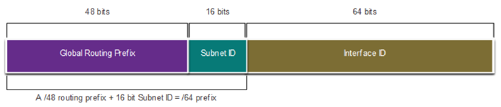

## Файлы конфигураций и packet tracer
Пароль консоли: *cisco*

Пароль привилегированного режима: *class*

- [S1](conf/S1.conf)
- [R1](conf/R1.conf)
- [Cisco PT](lesson10.pkt)