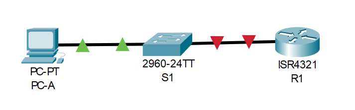
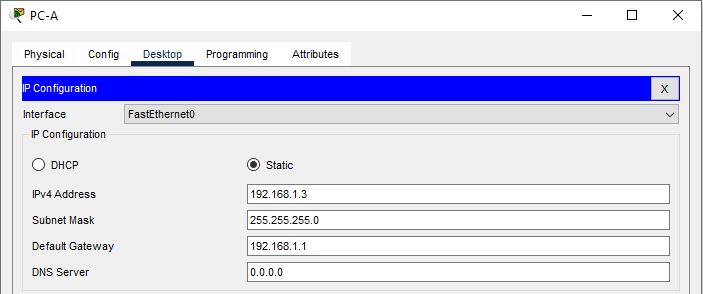
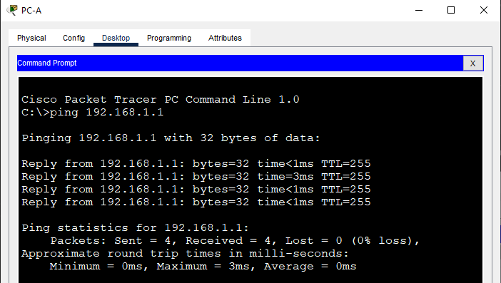
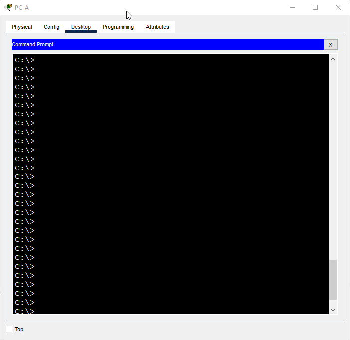

# Доступ к сетевым устройствам по протоколу SSH
## Исходные данные
### Топология


### Таблица адресации
| Устройство | Интерфейс | IP-адрес     | Маска подсети | Шлюз по умолчанию |
|------------|-----------|--------------|---------------|-------------------|
| R1         | G0/0/1    | 192.168.1.1  | 255.255.255.0 | -                 |
| S1         | VLAN 1    | 192.168.1.11 | 255.255.255.0 | 192.168.1.1       |
| PC-A       | NIC       | 192.168.1.3  | 255.255.255.0 | 192.168.1.1       |

## Задачи
- Настройка основных параметров устройства
- Настройка маршрутизатора для доступа по протоколу SSH
- Настройка коммутатора для доступа по протоколу SSH
- SSH через интерфейс командной строки (CLI) коммутатора

## Настройка основных параметров устройств
Строим топологию



Выполняем настройку маршрутизатора (в режиме глобальной конфигурации):

```
no ip domain-lookup
hostname R1
!
line console 0
 password cisco
 login
!
line vty 0 4
 password cisco
 login
!
enable secret class
!
service password-encryption
!
banner motd #
Unauthorized access is strictly prohibited.#
!
interface GigabitEthernet0/0/1
 ip address 192.168.1.1 255.255.255.0
 no shutdown
!
```

И настраиваем компьютер



Проверяем что компьютер имеет может достучаться до маршрутизатора путём отправки эхо-запроса



## Настройка маршрутизатора для доступа по протоколу SSH
Настраиваем SSH и Telnet, генерируем ключи, создаём пользователя

```
ip domain-name R1
crypto key generate rsa general-keys modulus 2048
username admin privilege 15 secret Adm1nP @55
!
line vty 0 4
 login local
 transport input all
```

Проверяем что мы можем подключиться с компьютера на роутер по SSH



Отлично! Доступ получен

## Настройка коммутатора для доступа по протоколу SSH
Выполняем базовую настройку коммутатора
```
no ip domain-lookup
hostname S1
!
line console 0
 password cisco
 login
!
line vty 0 15
 password cisco
 login
!
enable secret class
!
service password-encryption
!
banner motd #
Unauthorized access is strictly prohibited.#
!
interface Vlan1
 ip address 192.168.1.11 255.255.255.0
 no shutdown
!
ip default-gateway 192.168.1.1
```

Настраиваем доступ к коммутатору по SSH и Telnet
```
ip domain-name S1
crypto key generate rsa general-keys modulus 2048
username admin privilege 15 secret Adm1nP @55
!
line vty 0 15
 login local
 transport input all
```

Теперь к коммутатору можно получить доступ по протоколу SSH

## Настройка протокола SSH с использованием интерфейса командной строки (CLI) коммутатора
Пробуем подключиться к маршрутизатору из консоли коммутатора


## Вопросы для повторения
**Q: Как предоставить доступ к сетевому устройству нескольким пользователям, у каждого из которых есть собственное имя пользователя?**

**A:** Необходимо создать каждому пользователю учётную запись в локальной базе данных устройства.

## Файлы конфигураций и packet tracer
Пароль консоли: *cisco*

Пароль привилегированного режима: *class*

Пользователь *admin* с паролем *Adm1nP @55*

- [S1](conf/S1.conf)
- [R1](conf/R1.conf)
- [Cisco PT](lesson13.pkt)