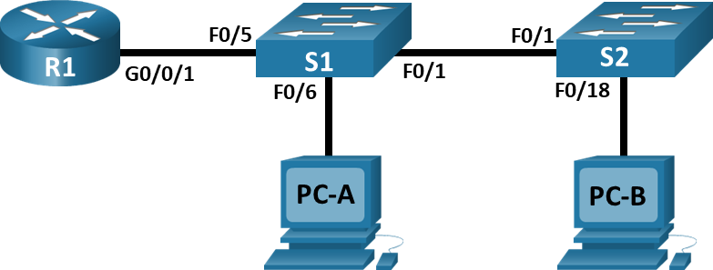
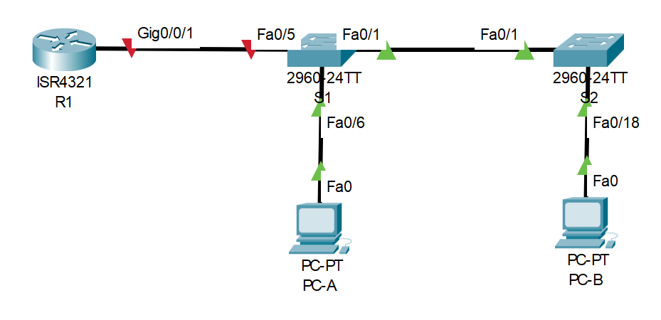
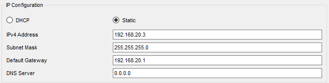
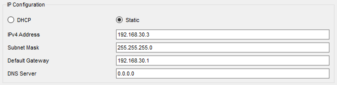
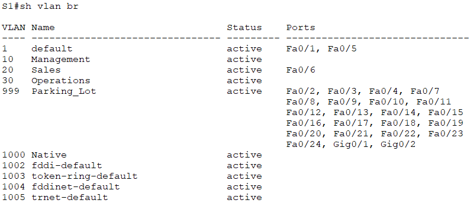
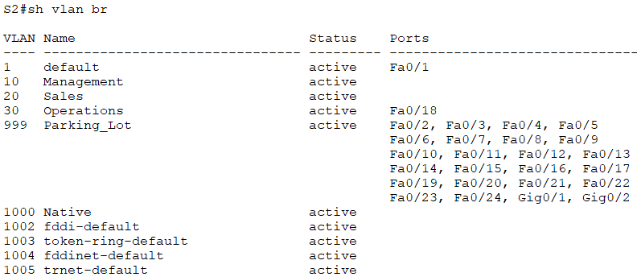
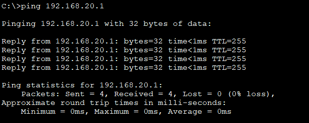
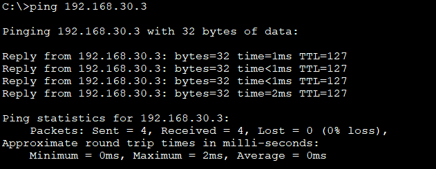
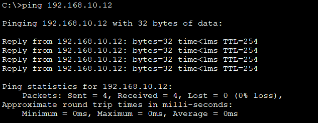
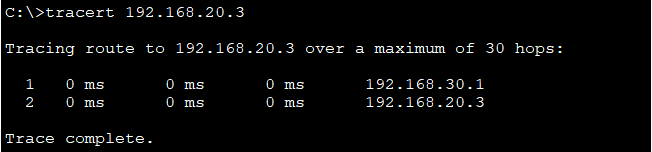

# Внедрение маршрутизации между виртуальными локальными сетями
## Исходные данные
### Топология


### Таблица адресации
| Устройство | Интерфейс   | IP-адрес      | Маска подсети | Шлюз по умолчанию |
|------------|-------------|---------------|---------------|-------------------|
| R1         | G0/0/1.10   | 192.168.10.1  | 255.255.255.0 | -                 |
| R1         | G0/0/1.20   | 192.168.20.1  | 255.255.255.0 | -                 |
| R1         | G0/0/1.30   | 192.168.30.1  | 255.255.255.0 | -                 |
| R1         | G0/0/1.1000 | -             | -             | -                 |
| S1         | VLAN 10     | 192.168.10.11 | 255.255.255.0 | 192.168.10.1      |
| S2         | VLAN 10     | 192.168.10.12 | 255.255.255.0 | 192.168.10.1      |
| PC-A       | NIC         | 192.168.20.3  | 255.255.255.0 | 192.168.20.1      |
| PC-B       | NIC         | 192.168.30.3  | 255.255.255.0 | 192.168.30.1      |

### Таблица VLAN
| VLAN | Имя         | Назначенный интерфейс                                         |
|------|-------------|---------------------------------------------------------------|
| 10   | Management  | S1: VLAN 10 </br>S2: VLAN 10                                  |
| 20   | Sales       | S1: F0/6                                                      |
| 30   | Operations  | S2: F0/18                                                     |
| 999  | Parking_Lot | S1: F0/2-4, F0/7-24, G01-2 </br>S2: F0/2-17, F0/19-24, G0/1-2 |
| 1000 | Native      | -                                                             |

## Задачи
- Создание сети и настройка основных параметров устройства
- Создание сетей VLAN и назначение портов коммутатора
- Настройка транка 802.1Q между коммутаторами
- Настройка маршрутизации между сетями VLAN
- Проверка, что маршрутизация между VLAN работает

## Создание сети и настройка основных параметров устройства
Строим топологию



### Базовые параметры маршрутизатора
```
hostname R1
no ip domain-lookup
!
enable secret class
!
line con 0
 password cisco
 login
!
line vty 0 4
 password cisco
 login
!
service password-encryption
!
banner motd #
Ne znaesh, ne trogai! #
!
clock timezone MSK 0
!
```

Время настраиваем сверяясь с часами, такое в скрипт не запишешь.

### Базовые параметры коммутаторов
Параметры коммутаторов приведу на примере коммутатора **S1**

```
hostname S1
no ip domain-lookup
!
enable secret class
!
line con 0
 password cisco
 login
!
line vty 0 15
 password cisco
 login
!
service password-encryption
!
banner motd #
Uhodi!!#
!
clock timezone MSK 0
!
```

Время настраиваем сверяясь с часами.

### Настройка компьютеров
Адресацию на ПК настраиваем согласно таблице исходных данных

**PC-A:**



**PC-B:**



## Создание сетей VLAN и назначение портов коммутатора
Согласно таблице настраиваем VLAN на коммутаторах, интерфейсы управления и шлюз по умолчанию. Конфигурация приводится на примере коммутатора **S1**.

```
vlan 10
 name Management
!
vlan 20
 name Sales
!
vlan 30
 name Operations
!
vlan 999
 name Parking_Lot
!
vlan 1000
 name Native
!
interface vlan 10
 ip address 192.168.10.11 255.255.255.0
 no shutdown
!
ip default-gateway 192.168.10.1
!
interface range f0/2-4,f0/7-24,g0/1-2
 shutdown
 switchport access vlan 999
!
interface f0/6
 switchport access vlan 20
!
```

На текущем этапе имеем следующую конфигурацию портов коммутаторов

**S1:**



**S2:**



## Конфигурация магистрального канала стандарта 802.1Q между коммутаторами
Настраиваем транк между коммутаторами, порт `F0/1` на каждом коммутаторе

```
interface f0/1
 switchport mode trunk
 switchport trunk native vlan 1000
 switchport trunk allowed vlan 10,20,30,1000
```

И настраиваем транк порт `F0/5` в сторону маршрутизатора на коммутаторе **S1**

```
interface f0/5
 switchport mode trunk
 switchport trunk native vlan 1000
 switchport trunk allowed vlan 10,20,30,1000
```

## Настройка маршрутизатора между сетями VLAN
```
interface g0/0/1
 no shutdown
!
interface g0/0/1.10
 encapsulation dot1q 10
 ip address 192.168.10.1 255.255.255.0
!
interface g0/0/1.20
 encapsulation dot1q 20
 ip address 192.168.20.1 255.255.255.0
!
interface g0/0/1.30
 encapsulation dot1q 30
 ip address 192.168.30.1 255.255.255.0
!
interface g0/0/1.1000
 encapsulation dot1q 1000 native
!
```

## Проверка работоспособности маршрутизации между VLAN
**Ping с PC-A на шлюз по умолчанию:**



**Ping с PC-A на PC-B:**



**Ping с PC-A на коммутатор S2:**



**Tracert с PC-B до PC-A:**



В трассировке видим IP-адрес нашего шлюза по умолчанию в качестве промежуточного узла.

## Файлы конфигураций и packet tracer
Пароль консоли: *cisco*

Пароль привилегированного режима: *class*

- [S1](conf/S1.conf)
- [S2](conf/S2.conf)
- [R1](conf/R1.conf)
- [Cisco PT](lesson15.pkt)