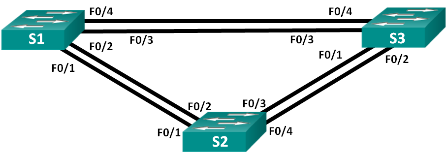
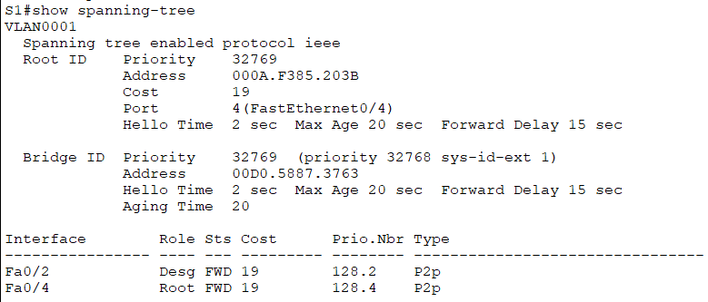
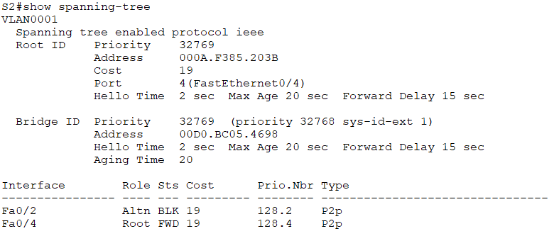
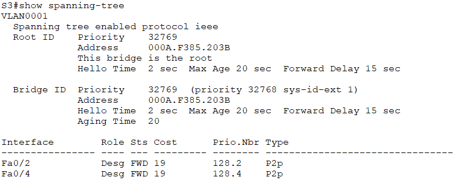
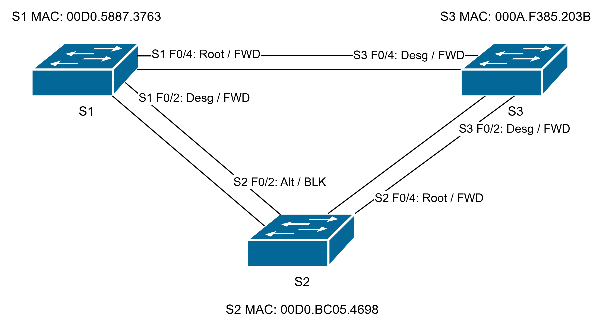

# Развертывание коммутируемой сети с резервными каналами
## Исходные данные
### Топология



### Таблица адресации
| Устройство | Интерфейс | IP-адрес    | Маска подсети |
|------------|-----------|-------------|---------------|
| S1         | VLAN 1    | 192.168.1.1 | 255.255.255.0 |
| S2         | VLAN 1    | 192.168.1.2 | 255.255.255.0 |
| S3         | VLAN 1    | 192.168.1.3 | 255.255.255.0 |

## Задачи
- Создание сети и настройка основных параметров устройства
- Выбор корневого моста
- Наблюдение за процессом выбора протоколом STP порта, исходя из стоимости портов
- Наблюдение за процессом выбора протоколом STP порта, исходя из приоритета портов

## Создание сети и настройка основных параметров устройства
Строим топологию


Настройку базовых параметров приводится на примере коммутатора S1

```
no ip domain-lookup
hostname S1
!
enable secret class
!
line vty 0 15
 password cisco
 login
!
line con 0
 password cisco
 login
 logging synchronous
!
service password-encryption
!
banner motd #
Unauthorized access is strictly prohibited!#
!
interface vlan 1
 ip address 192.168.1.1 255.255.255.0
 no shutdown
!
```

После настройки коммутаторов проверяем доступность их друг относительно друга. Эхо-запросы успешно проходят между устройствами.

## Определение корневого моста
Выключим все порты на коммутаторах
```
interface range f0/1-24,g0/1-2
 shutdown
```

Подключенные порты настраиваем как транк
```
interface range f0/1-4
 switchport mode trunk
```

Включаем порты F0/2 и F0/4 и смотрим данные протокола spanning-tree
```
interface range f0/2,f0/4
 no shutdown
!
```

**S1:**



**S2:**



**S3:**



Получаем следующую картину состояния портов



В текущей конфигурации корневым мостом стал коммутатор **S3** т.к. при прочих равных его MAC адрес, а соответственно и BID, является наименьшим. Соответственно порты на соседних коммутаторах подключенных к нему (S1: F0/4 и S2: F0/4) получили роль **Root**.

В качестве альтернативного выбран и заблокирован порт **F0/2** коммутатора **S2**, т.к. BID этого коммутатора самый большой

## Наблюдение за процессом выбора протоколом STP порта, исходя из стоимости портов
