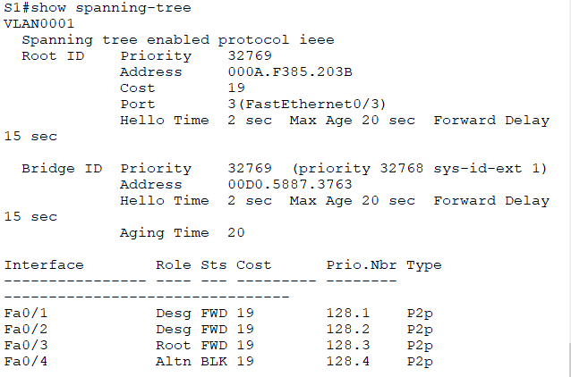
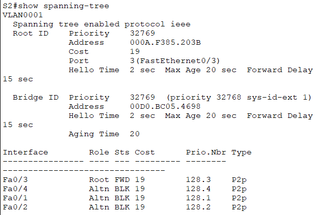
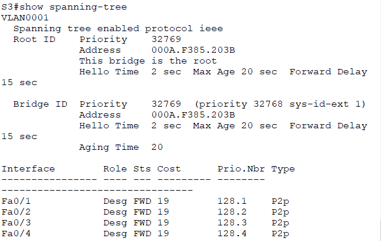

# Развертывание коммутируемой сети с резервными каналами
## Исходные данные
### Топология


### Таблица адресации
| Устройство | Интерфейс | IP-адрес    | Маска подсети |
|------------|-----------|-------------|---------------|
| S1         | VLAN 1    | 192.168.1.1 | 255.255.255.0 |
| S2         | VLAN 1    | 192.168.1.2 | 255.255.255.0 |
| S3         | VLAN 1    | 192.168.1.3 | 255.255.255.0 |

## Задачи
- Создание сети и настройка основных параметров устройства
- Выбор корневого моста
- Наблюдение за процессом выбора протоколом STP порта, исходя из стоимости портов
- Наблюдение за процессом выбора протоколом STP порта, исходя из приоритета портов

## Создание сети и настройка основных параметров устройства
Строим топологию


Настройку базовых параметров приводится на примере коммутатора S1

```
no ip domain-lookup
hostname S1
!
enable secret class
!
line vty 0 15
 password cisco
 login
!
line con 0
 password cisco
 login
 logging synchronous
!
service password-encryption
!
banner motd #
Unauthorized access is strictly prohibited!#
!
interface vlan 1
 ip address 192.168.1.1 255.255.255.0
 no shutdown
!
```

После настройки коммутаторов проверяем доступность их друг относительно друга. Эхо-запросы успешно проходят между устройствами.

## Определение корневого моста
Выключим все порты на коммутаторах
```
interface range f0/1-24,g0/1-2
 shutdown
!
```

Подключенные порты настраиваем как транк
```
interface range f0/1-4
 switchport mode trunk
!
```

Включаем порты F0/2 и F0/4 и смотрим данные протокола spanning-tree
```
interface range f0/2,f0/4
 no shutdown
!
```

**S1:**


**S2:**


**S3:**


Получаем следующую картину состояния портов


> **Q: Какой коммутатор является корневым мостом?**
> 
> **A:** В текущей конфигурации корневым мостом стал коммутатор **S3**

> **Q: Почему этот коммутатор был выбран протоколом spanning-tree в качестве корневого моста?**
> 
> **A:** Данный коммутатор был выбран корневым мостом, т.к. при прочих равных его MAC адрес, а соответственно и BID, является наименьшим. 

> **Q: Какие порты на коммутаторе являются корневыми портами?**
> 
> **A:** Порты на коммутаторах **S1** и **S2** (S1: F0/4 и S2: F0/4) подключенные к корневому коммутатору **S3** получили роль **Root**

> **Q: Какие порты на коммутаторе являются назначенными портами?**
> 
> **A:** Назначенными являются все порты корневого коммутатора **S3** и порт **F0/2** коммутатора **S1**

> **Q: Какой порт отображается в качестве альтернативного и в настоящее время заблокирован?**
> 
> **A:** В качестве альтернативного выбран порт **F0/2** коммутатора **S2** и заблокирован.

> **Q: Почему протокол spanning-tree выбрал этот порт в качестве невыделенного (заблокированного) порта?**
> 
> **A:** Данный порт был заблокирован т.к. при равных **Root Path Cost** был получен от коммутатор с меньшим **Bridge ID**, а значит более приоритетный.

## Наблюдение за процессом выбора протоколом STP порта, исходя из стоимости портов
В текущей конфигурации заблокированный порт имеет коммутатор **S2**. Изменим стоимость порта корневого моста:

```
interface fa 0/4
 spanning-tree vlan 1 cost 18
!
```

После данной настройки роли портов поменялись местами.

> **Q: Почему протокол spanning-tree заменяет ранее заблокированный порт на назначенный порт и блокирует порт, который был назначенным портом на другом коммутаторе?**
>
> **A:** После изменения стоимости порта до корневого коммутатора для коммутатора **S1** путь до корневого моста через коммутатор **S2** стал выгоднее чем путь от **S2** через **S1**

Сбросим значение стоимости порта:

```
interface fa 0/4
 no spanning-tree vlan 1 cost 18
!
```

После сброса значения стоимости порта к значению по умолчанию роли портов вернулись в изначальное состояние.

## Наблюдение за процессом выбора протокола STP порта, исходя из приоритета порта
Активируем ранее выключенные порты **F0/1** и **F0/3** на всех коммутаторах:

```
interface range f0/1,f0/3
 no shutdown
!
```

Смотрим данные протокола spanning-tree:

**S1:**




**S2:**



**S3:**



> **Q: Какой порт выбран протоколом STP в качестве порта корневого моста на каждом коммутаторе некорневого моста?**
> 
> **A:** С появлением порта до корневого моста с меньшим приоритетом он становится новым **Root** портом, а порт с большим приоритетом становится заблокированным.

## Вопросы для повторения
> **Q: Какое значение протокол STP использует первым после выбора корневого моста, чтобы определить выбор порта?**
> 
> **A:** Сначала сравнивается значении стоимости пути **Root Path Cost** до корневого моста. 

> **Q: Если первое значение на двух портах одинаково, какое следующее значение будет использовать протокол STP при выборе порта?**
>
> **A:** Если значение стоимости пути **Root Path Cost** одинаково, то сравнивается значение **Bridge ID** и наименьшее является приоритетным.

> **Q: Если оба значения на двух портах равны, каким будет следующее значение, которое использует протокол STP при выборе порта?**
>
> **A:** В случае если и **Root Path Cost** и **Bridge ID** одинаково, то сравнивается **Port ID** и наименьшее значение является приоритетным.

## Файлы конфигураций и packet tracer
Пароль консоли: *cisco*

Пароль привилегированного режима: *class*

- [S1](conf/S1.conf)
- [S2](conf/S2.conf)
- [S3](conf/S3.conf)
- [Cisco PT](lesson16.pkt)