# Содержание
- [Реализация DHCPv4](#реализация-dhcpv4)
- [Настройка DHCPv6](#настройка-dhcpv6)

# Реализация DHCPv4
## Исходные данные

> [!NOTE]
> Построенная топология отличается от приведённой в методичке в части нумерации портов. Связано это с тем что данная работа выполняется в эмуляторе сети EVE-NG и нумерация портов устройств отличается от таковой в Cisco Packet Tracer

### Топология

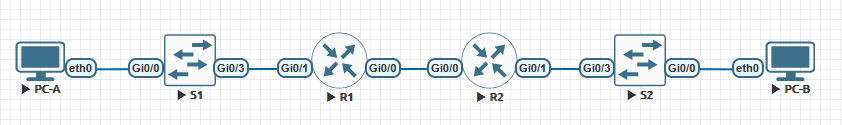

### Таблица адресации
| Устройство | Интерфейс   | IP-адрес      | Маска подсети   | Шлюз по умолчанию |
|------------|-------------|---------------|-----------------|-------------------|
| R1         | Gi0/0       | 10.0.0.1      | 255.255.255.252 | —                 |
| R1         | Gi0/1       | —             | —               | —                 |
| R1         | Gi0/1.100   | 192.168.1.1   | 255.255.255.192 | —                 |
| R1         | Gi0/1.200   | 192.168.1.65  | 255.255.255.224 | —                 |
| R1         | Gi0/1.1000  | —             | —               | —                 |
| R2         | Gi0/0       | 10.0.0.2      | 255.255.255.252 | —                 |
| R2         | Gi0/1       | 192.168.1.97  | 255.255.255.240 | —                 |
| S1         | VLAN 200    | 192.168.1.66  | 255.255.255.224 | 192.168.1.65      |
| S2         | VLAN 1      | 192.168.1.98  | 255.255.255.240 | 192.168.1.97      |
| PC-A       | NIC         | DHCP          | DHCP            | DHCP              |
| PC-B       | NIC         | DHCP          | DHCP            | DHCP              |

### Таблица VLAN
| VLAN | Имя         | Назначенный интерфейс       |
|------|-------------|-----------------------------|
| 1    | Нет         | S2: Gi0/0                   |
| 100  | Клиенты     | S1: Gi0/0                   |
| 200  | Управление  | S1: VLAN 200                |
| 999  | Parking_Lot | S1: Gi0/1-2                 |
| 1000 | Собственная | —                           |

## Задачи
- Создание сети и настройка основных параметров устройства
- Настройка и проверка двух серверов DHCPv4 на R1
- Настройка и проверка DHCP-ретрансляции на R2

## Создание сети и настройка основных параметров устройства
### Схема адресации
Разобьём сеть 192.168.1.0/24 на несколько более мелких:
- **Подсеть A** для клиентов **R1** (минимум 58 хостов): 192.168.1.0/26 (192.168.1.1-62)
- **Подсеть B** управления (минимум 28 хостов): 192.168.1.64/27 (192.168.1.65-94)
- **Подсеть C** для клиентов **R2** (минимум 12 хостов): 192.168.1.96/28 (192.168.1.97-110)

### Базовая настройка маршрутизаторов
Выполним базовую настройку на примере маршрутизатора **R1**

```
hostname R1
no ip domain-lookup
!
enable secret class
!
line con 0
 password cisco
 login
 logging synchronous
!
line vty 0 4
 password cisco
 login
!
service password-encryption
!
banner motd #
Unauthorized access is strictly prohibited!#
!
clock timezone MSK 3
!
```

### Настраиваем R1
Выполняем настройку сабинтерфейсов согласно таблице IP-адресации

```
interface GigabitEthernet0/1
 no shutdown
!
interface GigabitEthernet0/1.100
 description CLIENTS
 encapsulation dot1Q 100
 ip address 192.168.1.1 255.255.255.192
!
interface GigabitEthernet0/1.200
 description MGMT
 encapsulation dot1Q 200
 ip address 192.168.1.65 255.255.255.224
!
interface GigabitEthernet0/1.1000
 encapsulation dot1Q 1000 native
!
```

### Настраиваем R2
На данном маршрутизаторе у нас только одна подсеть, VLAN нет. Настраиваем

```
!
interface GigabitEthernet0/1
 no shutdown
 ip address 192.168.1.97 255.255.255.240
!
```

### Настраиваем статическую маршрутизацию на маршрутизаторах R1 и R2
Маршрутизаторы соединены друг с другом через интерфейсы Gi0/0. Настраиваем их, а также маршруты по умолчанию указывающих друг на друга

**R1:**

```
!
interface gi0/0
 no shutdown
 ip address 10.0.0.1 255.255.255.252
!
ip route 0.0.0.0 0.0.0.0 10.0.0.2
!
```

**R2:**

```
!
interface gi0/0
 no shutdown
 ip address 10.0.0.2 255.255.255.252
!
ip route 0.0.0.0 0.0.0.0 10.0.0.2
!
```

Проверим что подсети одного маршрутизатора доступны с другого

**R1 -> R2:**

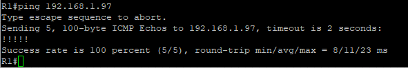

**R2 -> R1:**

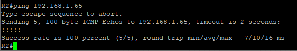

### Настройка базовых параметров коммутаторов
Выполним базовую настройку на примере маршрутизатора **S1**

```
hostname S1
no ip domain-lookup
!
enable secret class
!
line con 0
 password cisco
 login
 logging synchronous
!
line vty 0 15
 password cisco
 login
!
service password-encryption
!
banner motd #
Unauthorized access is strictly prohibited!#
!
clock timezone MSK 3
!
```

### Создание сети VLAN на коммутаторе и назначение соответствующим интерфейсам коммутатора
На коммутаторе **S1** создаём VLAN из таблицы, создаём интерфейс VLAN 200 и назначаем адрес согласно таблице, указываем шлюз по умолчанию.

```
!
vlan 100
 name CLIENTS
!
vlan 200
 name MGMT
!
vlan 999
 name Parking_Lot
!
vlan 1000
 name NATIVE
!
interface Vlan200
 ip address 192.168.1.66 255.255.255.224
 no shutdown
!
ip route 0.0.0.0 0.0.0.0 192.168.1.65
!
```

Назначаем VLAN соответствующим интерфейсам коммутатора, настраиваем транк интерфейс.

```
!
interface range gi0/1-2
 switchport access vlan 999
 shutdown
!
interface gi0/3
 switchport trunk encapsulation dot1q
 switchport mode trunk
 switchport trunk allowed vlan 100,200,1000
 switchport trunk native vlan 1000
!
```

На коммутаторе **S2** конфигурация несколько скромнее. Настраиваем IP-адрес на интерфейсе VLAN 1, указываем шлюз по умолчанию, неиспользуемые порты выключаем.

```
!
interface Vlan1
 ip address 192.168.1.98 255.255.255.240
 no shutdown
!
ip route 0.0.0.0 0.0.0.0 192.168.1.97
!
interface range gi0/1-2
 shutdown
!
```

## Настройка и проверка двух серверов DHCPv4 на R1
На маршрутизаторе R1 необходимо настроить сервер DHCPv4 для обслуживания двух подсетей, **Подсеть A (192.168.1.0/26)** и **Подсеть C (192.168.1.96/28)**.

Исключим из каждого пула первые пять адресов

```
ip dhcp excluded-address 192.168.1.1 192.168.1.5
ip dhcp excluded-address 192.168.1.97 192.168.1.101
```

Создадим и настроим пулы

```
ip dhcp pool NET_A
 network 192.168.1.0 /26
 domain-name CCNA-lab.com
 default-router 192.168.1.0
 lease 2 12 30
!
ip dhcp pool R2_Client_LAN
 network 192.168.1.96 /28
 domain-name CCNA-lab.com
 default-router 192.168.1.97
 lease 2 12 30
```

Посмотрим конфигурацию сервера 

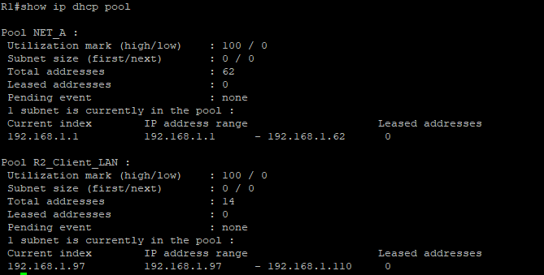

Как видим DHCPv4 сервер ещё не выдал ни одного IPv4-адреса. Попробуем получить адрес на пк **PC-A**

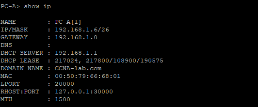

И успешно адрес получаем. Посмотрим таблицу привязки на сервере и видим адрес нашего **PC-A**

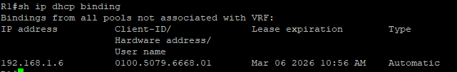

## Настройка и проверка DHCP-ретрансляции на R2
Так как сервер DHCPv4 на подсеть за **R2** расположен на **R1** для успешной выдачи адресов клиентам этой сети на маршрутизаторе **R2** необходимо настроить DHCP-ретрансляцию.

```
!
interface gi0/1
 ip helper-address 10.0.0.1
!
```

Пробуем получить адрес на пк **PC-B**

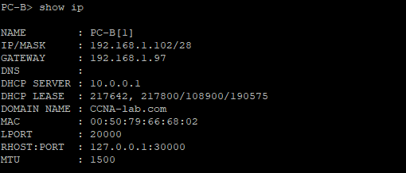

И успешно адрес получаем. Посмотрим таблицу привязки на сервере и видим что добавился адрес нашего **PC-B**

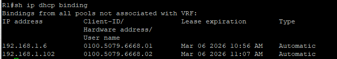

# Настройка DHCPv6
## Исходные данные

> [!NOTE]
> Построенная топология отличается от приведённой в методичке в части нумерации портов. Связано это с тем что данная работа выполняется в эмуляторе сети EVE-NG и нумерация портов устройств отличается от таковой в Cisco Packet Tracer

### Топология


### Таблица адресации
| Устройство | Интерфейс | IPv6-адрес            |
|------------|-----------|-----------------------|
| R1         | Gi0/0     | 2001:db8:acad:2::1/64 |
| R1         | Gi0/0     | fe80::1               |
| R1         | Gi0/1     | 2001:db8:acad:1::1/64 |
| R1         | Gi0/1     | fe80::1               |
| R2         | Gi0/0     | 2001:db8:acad:2::2/64 |
| R2         | Gi0/0     | fe80::2               |
| R2         | Gi0/1     | 2001:db8:acad:3::1/64 |
| R2         |Gi0/1      | fe80::1               |
| PC-A       |NIC        | DHCP                  |
| PC-B       |NIC        | DHCP                  |

## Задачи
- Создание сети и настройка основных параметров устройства
- Проверка назначения адреса SLAAC от R1
- Настройка и проверка сервера DHCPv6 без гражданства на R1
- Настройка и проверка состояния DHCPv6 сервера на R1
- Настройка и проверка DHCPv6 Relay на R2

## Создание сети и настройка основных параметров устройства
Строим схему и производим базовую настройку маршрутизаторов и коммутаторов. Конфигурация приведена на примере маршрутизатора **R1**, конфигурация остальных устройств аналогична.

```
!
hostname R1
no ip domain-lookup
!
enable secret class
!
line con 0
 password cisco
 login
 logging synchronous
!
line vty 0 4
 password cisco
 login
 logging synchronous
!
service password-encryption
!
banner motd #
Unauthorized access is strictly prohibited!#
!
```

Настроим адреса на интерфейсах маршрутизаторов согласно таблице адресации и выведем информацию о настроенных адресах

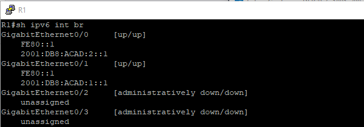

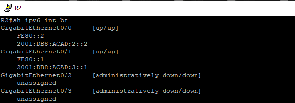

Настроим статическую адресацию между маршрутизаторами

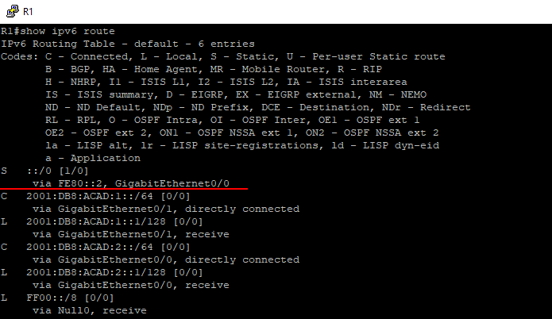

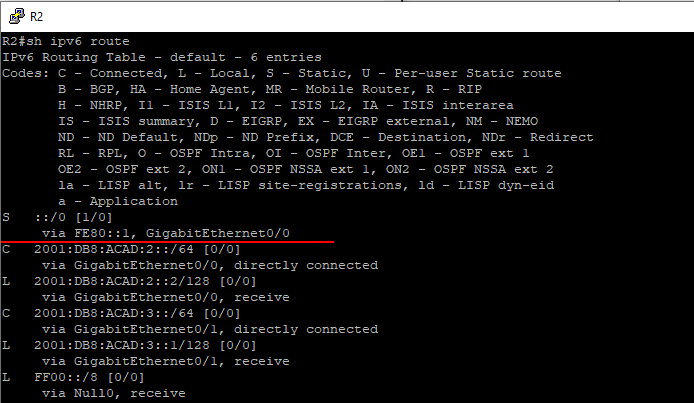

Проверим маршрутизацию отправив пинг запрос с **R1** на **R2**

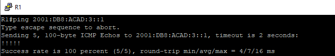

## Проверка назначения адреса SLAAC от R1
Запускаем **PC-A** и видим что он получил IPv6-адрес

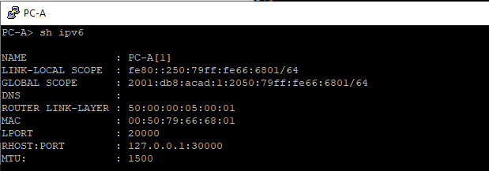

## Настройка и проверка сервера DHCPv6 без гражданства на R1
Создадим и настроим пул `R1-STATELESS`

```
!
ipv6 dhcp pool R1-STATELESS
 dns-server 2001:db8:acad::254
 domain-name STATELESS.com
!
```

Настроим интерфейс для использования созданного пула

```
!

!
```

## Настройка и проверка состояния DHCPv6 сервера на R1

## Настройка и проверка DHCPv6 Relay на R2