# Конфигурация безопасности коммутатора
## Исходные данные

> [!NOTE]
> Построенная топология отличается от приведённой в методичке в части нумерации портов. Связано это с тем что данная работа выполняется в эмуляторе сети EVE-NG и нумерация портов устройств отличается от таковой в Cisco Packet Tracer

### Топология


### Таблица адресации
| Устройство | Interface / VLAN | IP-адрес       | Маска подсети |
|------------|------------------|----------------|---------------|
| R1         | e0/0             | 192.168.10.1   | 255.255.255.0 |
| R1         | Loopback 0       | 10.10.1.1      | 255.255.255.0 |
| S1         | VLAN 10          | 192.168.10.201 | 255.255.255.0 |
| S2         | VLAN 10          | 192.168.10.202 | 255.255.255.0 |
| PC-A       | eth0             | DHCP           |               |
| PC-B       | eth0             | DHCP           |               |

### Таблица VLAN
| VLAN | Имя         | Назначенный интерфейс         |
|------|-------------|-------------------------------|
| 10   | Management  | S1: e0/0, e0/2 </br> S2: e0/2 |
| 333  | Native      | S1: e0/1 </br> S2: e0/1       |
| 999  | Parking_Lot | S1: 0/3 </br> S2: e0/0, e0/3  |

## Задачи
- Настройка основного сетевого устройства
- Настройка сетей VLAN
- Настройка безопасности коммутатора

## Настройка основного сетевого устройства
### Настройка маршрутизатора R1
Грузим на маршрутизатор **R1** скрипт адаптированный под нашу топологию

```
enable
configure terminal
hostname R1
no ip domain lookup
ip dhcp excluded-address 192.168.10.1 192.168.10.9
ip dhcp excluded-address 192.168.10.201 192.168.10.202
ip dhcp relay information trust-all
!
ip dhcp pool Students
 network 192.168.10.0 255.255.255.0
 default-router 192.168.10.1
 domain-name CCNA2.Lab-11.6.1
!
interface Loopback0
 ip address 10.10.1.1 255.255.255.0
!
interface Ethernet0/0
 description Link to S1
 ip address 192.168.10.1 255.255.255.0
 no shutdown
!
line con 0
 logging synchronous
 exec-timeout 0 0
```

Проверим интерфейсы 

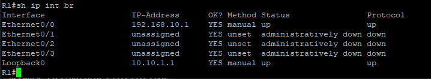

### Настройка коммутаторов S1 и S2
Напишем и загрузим скрипт для настройки коммутатора **S1**

```
en
conf t
hostname S1
no ip domain lookup
!
vlan 10
 name Management
!
vlan 333
 name Native
!
vlan 999
 name ParkingLot
!
int vlan 10
 ip addr 192.168.10.201 255.255.255.0
 no shutdown
!
ip route 0.0.0.0 0.0.0.0 192.168.10.1
```

## Настройка безопасности коммутатора
### Реализация магистральных соединений
Настраиваем магистральные интерфейсы на коммутаторах:

```
en
conf t
!
int e0/1
 switchport trunk encapsulation dot1q
 switchport mode trunk
 switchport trunk native vlan 333
```

Проверим что интерфейсы успешно настроены на **S1** и **S2**

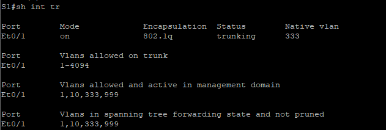

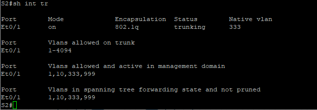

### Настройка портов доступа
Настраиваем порты доступа согласно таблице, неиспользуемые порты выключим

#### S1
```
en
conf t
!
int range e0/0,e0/2
 switchport mode access
 switchport access vlan 10
!
int e0/3
 switchport mode access
 switchport access vlan 999
 shutdown
```

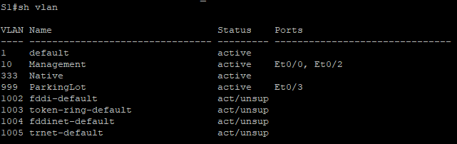

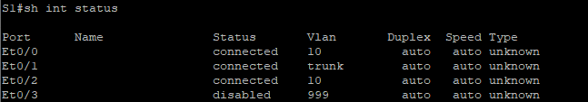

#### S2
```
en
conf t
!
int e0/2
 switchport mode access
 switchport access vlan 10
!
int range e0/0,e0/3
 switchport mode access
 switchport access vlan 999
 shutdown
```

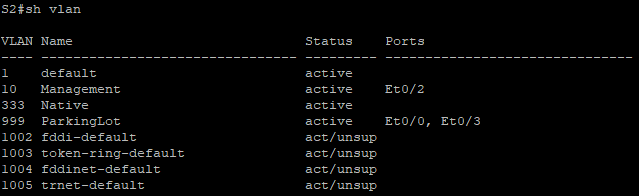

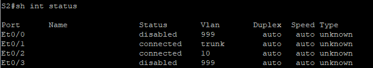

## Документирование и реализация функций безопасности порта
### S1
Текущие настройки безопасности порта на коммутаторе **S1**

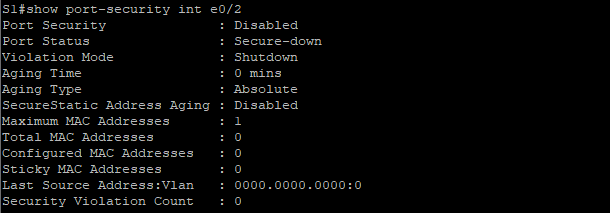

Включим port-security с следующими настройками:

```
en
conf t
int e0/2
 switchport port-security
 switchport port-security maximum 3 
 switchport port-security violation restrict
 switchport port-security aging time 60
 switchport port-security aging type inactivity
```

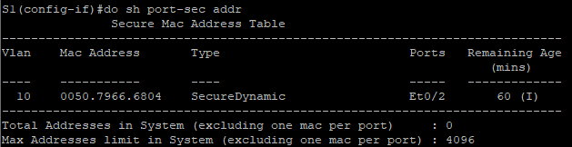

### S2
Стандартные настройки безопасности порта соответствуют таковым на коммутаторе **S1** так что сразу переходим к настройке

```
en
conf t
int e0/2
 switchport port-security
 switchport port-security maximum 2 
 switchport port-security mac-address sticky
 switchport port-security violation protect
 switchport port-security aging time 60
```

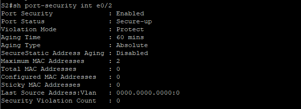

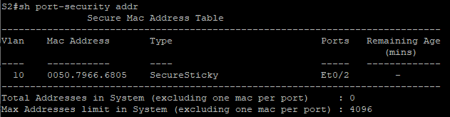

## Реализация безопасности DHCP snooping на коммутаторе S2
```
en
conf t
ip dhcp snooping
ip dhcp snooping vlan 10
!
int e0/1
 ip dhcp snooping trust
!
int e0/2
 ip dhcp snooping limit rate 5
```

Проверим состояние DHCP snooping

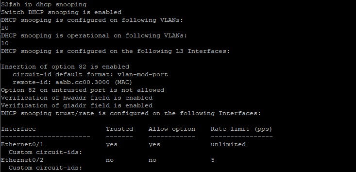

Обновим адрес на **PC-B** и посмотрим таблицу отслеживания на коммутаторе

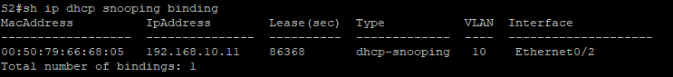

## Реализация PortFast и BPDU Guard
Настраиваем все порты доступа коммутаторов как PortFast

```
en
conf t
spanning-tree portfast bpduguard default
!
int range e0/0,e0/2,e0/3
 spanning-tree portfast
```

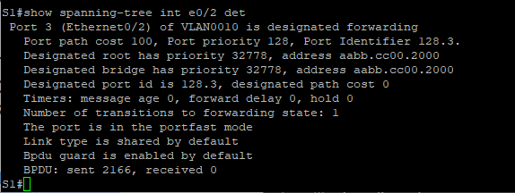

## Проверка доступности
С **PC-A**:

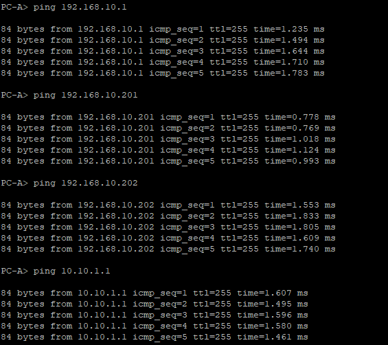

С **PC-B**:

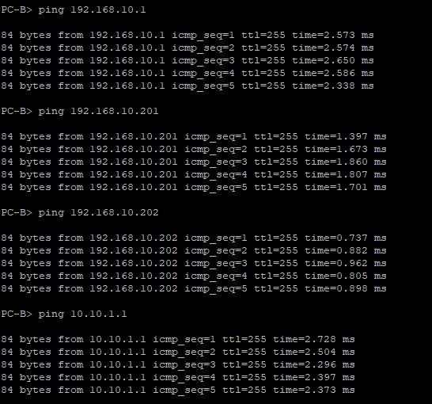

## Вопросы для повторения
**Q: С точки зрения безопасности порта на S2, почему нет значения таймера для оставшегося возраста в минутах, когда было сконфигурировано динамическое обучение - sticky?**

**A:** Таймер отсутствовал т.к. в режиме **sticky** изученный mac-адрес привязывается к порту и прописывается в конфигурации устройства

**Q: Что касается безопасности порта, в чем разница между типом абсолютного устаревания и типом устаревание по неактивности?**

**A:** При абсолютном устаревании изученные адреса порта удаляются по истечении указанного времени вне зависимости от того активны они или нет.