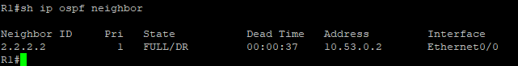
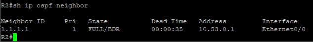
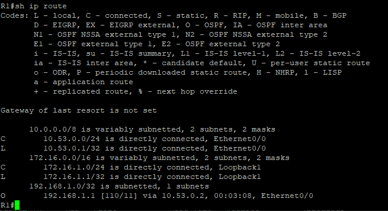
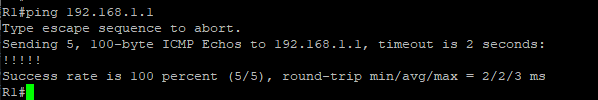
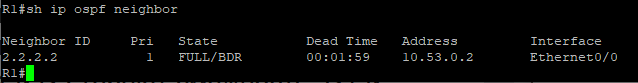
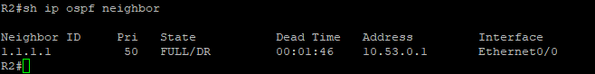
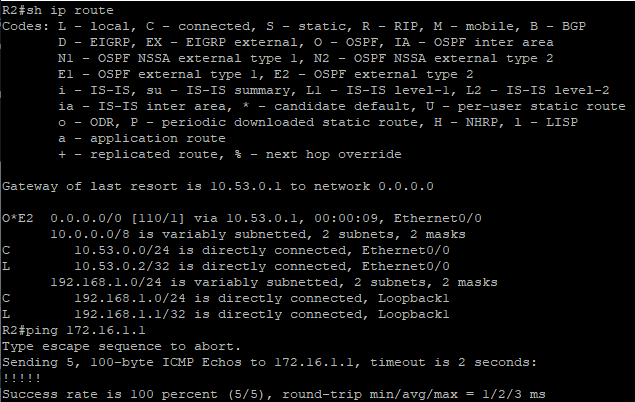
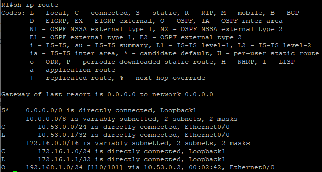
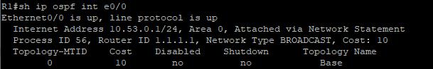
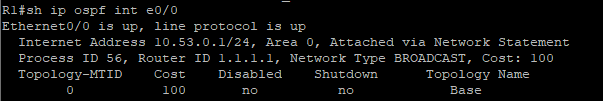

# Конфигурация безопасности коммутатора
## Исходные данные

> [!NOTE]
> Построенная топология отличается от приведённой в методичке в части нумерации портов. Связано это с тем что данная работа выполняется в эмуляторе сети EVE-NG и нумерация портов устройств отличается от таковой в Cisco Packet Tracer

### Топология


### Таблица адресации
| Устройство | Interface / VLAN | IP-адрес       | Маска подсети |
|------------|------------------|----------------|---------------|
| R1         | e0/0             | 10.53.0.1      | 255.255.255.0 |
| R1         | Loopback 1       | 172.16.1.1     | 255.255.255.0 |
| R2         | e0/0             | 10.53.0.2      | 255.255.255.0 |
| R2         | Loopback 1       | 192.168.1.1    | 255.255.255.0 |

## Задачи
- Создание сети и настройка основных параметров устройства
- Настройка и проверка базовой работы протокола OSPFv2 для одной области
- Оптимизация и проверка конфигурации OSPFv2 для одной области

## Создание сети и настройка основных параметров устройства
Построим топологию и выполним базовую настройку устройств на примере маршрутизатора **R1**

```
en
conf t
hostname R1
no ip domain lookup
service password-encryption
enable secret class
!
line con 0
 password cisco
 login
 logging synchronous
!
line vty 0 4
 password cisco
 login
!
banner motd #
Unauthorized access is strictly prohibited!#
```

## Настройка и проверка базовой работы протокола OSPFv2 для одной области
### Настроим IP-адреса согласно таблице

**R1:**

```
en
conf t
!
int e0/0
 ip addr 10.53.0.1 255.255.255.0
 no shutdown
!
int lo 1
 ip addr 172.16.1.1 255.255.255.0
```

**R2:**

```
en
conf t
!
int e0/0
 ip addr 10.53.0.2 255.255.255.0
 no shutdown
!
int lo 1
 ip addr 192.168.1.1 255.255.255.0
```

### Настроим OSPF

**R1:**

```
en
conf t
router ospf 56
 router-id 1.1.1.1
 network 10.53.0.0 0.0.0.255 area 0
```

**R2:**

```
en
conf t
router ospf 56
 router-id 2.2.2.2
 network 10.53.0.0 0.0.0.255 area 0
!
int lo 1
 ip ospf 56 area 0
```

После выполнения настроек видим что маршрутизаторы друг друга увидели и сформировали смежность





Также видим что на **R1** в таблице маршрутизации появился маршрут до анонсируемой маршрутизатором **R2** сети Loopback 1



Также проверим доступность этой сети с **R1**



> **Q: Какой маршрутизатор является DR? Какой маршрутизатор является BDR? Каковы критерии отбора?**
>
> **A:** В данной конфигурации **R2** является DR, а **R1** является BDR. Выборы производятся по следующим критериям:
> - Наибольший приоритет интерфейса (по умолчанию 1)
> - Наибольший Router ID

## Оптимизация и проверка конфигурации OSPFv2 для одной области
### Внесём изменения в настройки. 
Сделаем чтобы **R1** получил роль DR в нашей сети, изменим таймеры hello на обоих маршрутизаторах

**R1:**

```
en
conf t
int e0/0
 ip ospf priority 50
 ip ospf hello-interval 30
```

**R2:**

```
en
conf t
int e0/0
 ip ospf hello-interval 30
```

Перезапустим OSPF на маршрутизаторах и посмотрим что получилось





Видим что **R1** получил роль DR, а dead interval стал равный 2 минутам, что в 4 раза больше установленного нами hello interval.

### Настроим маршруты.
По легенде R1 имеет выход в интернет, так что делаем статический маршрут по умолчанию на loopback 1 и распространим его через OSPF

```
en
conf t
ip route 0.0.0.0 0.0.0.0 Loopback 1
!
router ospf 56
 default-information originate
```

Взглянем на таблицу маршрутизации на **R2** и проверим доступность loopback 1 на **R1**



### Настроим маршрутизатор **R2**
Настроим так чтобы маршрутизатор **R2** анонсировал маршрут до loopback 1 с маской /24. Также сделаем этот интерфейс пассивным чтобы OSPF не отправлял обновления в сеть loopback 1

```
en
conf t
router ospf 56
 passive-interface lo 1
!
int lo 1
 ip ospf network point-to-point
```

Видим что маска маршрута изменилась и теперь составляет 24



### Настроим эталонную пропускную способность на маршрутизаторах
Данную настройку необходимо выполнять на всех маршрутизаторах области

```
en
conf t
!
router ospf 56
 auto-cost reference-bandwidth 1000
```

Сравним как изменилась стоимость интерфейса на маршрутизаторе **R1**



