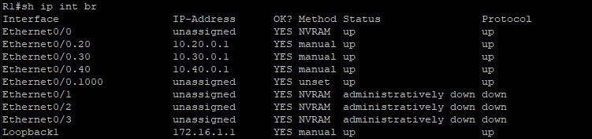

# Конфигурация безопасности коммутатора
## Исходные данные

> [!NOTE]
> Построенная топология отличается от приведённой в методичке в части нумерации портов. Связано это с тем что данная работа выполняется в эмуляторе сети EVE-NG и нумерация портов устройств отличается от таковой в Cisco Packet Tracer

### Топология


### Таблица адресации
| Устройство | Интерфейс | IP-адрес       | Маска подсети | Шлюз по умолчанию |
|------------|-----------|----------------|---------------|-------------------|
| R1         | e0/0      | -              | -             | -                 |
| R1         | e0/0.20   | 10.20.0.1      | 255.255.255.0 |                   |
| R1         | e0/0.30   | 10.30.0.1      | 255.255.255.0 |                   |
| R1         | e0/0.40   | 10.40.0.1      | 255.255.255.0 |                   |
| R1         | e0/0.1000 | -              | 255.255.255.0 |                   |
| R1         | Loopback1 | 172.16.1.1     | 255.255.255.0 |                   |
| R2         | e0/0      | 10.20.0.4      | 255.255.255.0 | -                 |
| S1         | VLAN 20   | 10.20.0.2      | 255.255.255.0 | 10.20.0.1         |
| S2         | VLAN 20   | 10.20.0.3      | 255.255.255.0 | 10.20.0.1         |
| PC-A       | eth0      | 10.30.0.10     | 255.255.255.0 | 10.30.0.1         |
| PC-B       | eth0      | 10.40.0.10     | 255.255.255.0 | 10.40.0.1         |


### Таблица VLAN
| VLAN | Имя         | Назначенный интерфейс  |
|------|-------------|------------------------|
| 20   | Management  | S2: e0/1               |
| 30   | Operations  | S1: e0/2               |
| 40   | Sales       | S2: e0/2               |
| 999  | ParkingLot  | S1: e0/3 </br>S2: e0/3 |
| 1000 | Native      |  —                     |

## Задачи
- [Создание сети и настройка основных параметров устройства](#создание-сети-и-настройка-основных-параметров-устройства)
- [Настройка и проверка списков расширенного контроля доступа](#настройка-и-проверка-списков-расширенного-контроля-доступа)

## Создание сети и настройка основных параметров устройства
Выполним базовую настройку сетевых устройств. 

### VLAN
Настроим на коммутаторах VLAN и назначим соответствующим портам

```
vlan 20
 name Management
vlan 30
 name Operations
vlan 40
 name Sales
vlan 999
 name ParkingLog
vlan 1000
 name Native
```

**S1:**

```
int e0/2
 switchport mode access
 switchport access vlan 30
int e0/3
 switchport mode access
 switchport access vlan 999
 shutdown
```

**S2:**

```
int e0/1
 switchport mode access
 switchport access vlan 20
int e0/2
 switchport mode access
 switchport access vlan 40
int e0/3
 switchport mode access
 switchport access vlan 999
 shutdown
```

### Магистральные каналы
Настроим транк между коммутаторами. Так как они соединены одноименными портами конфигурация будет следующей

```
int e0/0
 switchport trunk encapsulation dot1q
 switchport mode trunk
 switchport trunk allowed vlan 20,30,40,1000
 switchport trunk native vlan 1000
```

И настраиваем транк на коммутаторе **S1** к маршрутизатору с теми же параметрами

### Маршрутизация
#### R1
Настроим подинтерфейсы на маршрутизаторе **R1**, VLAN и IP-адреса

```
int e0/0.20
 description Management
 encapsulation dot1Q 20
 ip address 10.20.0.1 255.255.255.0

int e0/0.30
 description Operations
 encapsulation dot1Q 30
 ip address 10.30.0.1 255.255.255.0

int e0/0.40
 description Sales
 encapsulation dot1Q 40
 ip address 10.40.0.1 255.255.255.0

int e0/0.1000
 description Native
 encapsulation dot1Q 1000 native
```

Настроим loopback имитирующий подключение к интернету

```
int lo 1
 ip addr 172.16.1.1 255.255.255.0
```

Проверим конфигурацию подинтерфейсов
 


#### R2
Выполним настройку **R2**

```
ip route 0.0.0.0 0.0.0.0 10.20.0.1
!
int e0/0
 ip addr 10.20.0.4 255.255.255.0
 no sh
```

### Удалённый доступ

```
ip domain-name ccna-lab.com
ip ssh version 2
crypto key generate rsa general-keys modulus 1024
username SSHadmin privilege 15 secret $cisco123!
!
line vty 0 5
 transport input ssh
 login local
```

## Настройка и проверка списков расширенного контроля доступа