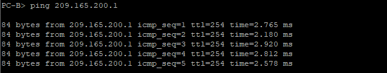
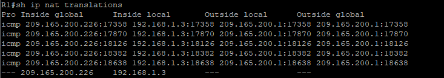
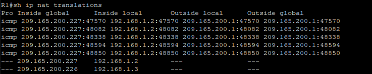
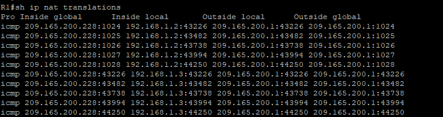
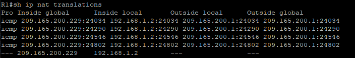

# Настройка NAT для IPv4
## Исходные данные

> [!NOTE]
> Построенная топология отличается от приведённой в методичке в части нумерации портов. Связано это с тем что данная работа выполняется в эмуляторе сети EVE-NG и нумерация портов устройств отличается от таковой в Cisco Packet Tracer

### Топология


### Таблица адресации

| Устройство | Интерфейс | IP-адрес        | Маска подсети   |
|------------|-----------|-----------------|-----------------|
| R1         | e0/0      | 209.165.200.230 | 255.255.255.248 |
| R1         | e0/1      | 192.168.1.1     | 255.255.255.0   |
| R2         | e0/0      | 209.165.200.225 | 255.255.255.248 |
| R2         | Lo1       | 209.165.200.1   | 255.255.255.224 |
| S1         | VLAN 1    | 192.168.1.11    | 255.255.255.0   |
| S2         | VLAN 1    | 192.168.1.12    | 255.255.255.0   |
| PC-A       | eth0      | 192.168.1.2     | 255.255.255.0   |
| PC-B       | eth0      | 192.168.1.3     | 255.255.255.0   |

## Задачи
- [Создание сети и настройка основных параметров устройства](#создание-сети-и-настройка-основных-параметров-устройства)
- [Настройка и проверка NAT для IPv4](#настройка-и-проверка-nat-для-ipv4)
- [Настройка и проверка PAT для IPv4](#настройка-и-проверка-pat-для-ipv4)
- [Настройка и проверка статического NAT для IPv4](#настройка-и-проверка-статического-nat-для-ipv4)

## Создание сети и настройка основных параметров устройства
В частности опишу настройку интерфейсов и IP-адресацию:

**R1:**

```
int e0/0
 ip addr 209.165.200.230 255.255.255.248
 no shutdown
!
int e0/1
 ip addr 192.168.1.1 255.255.255.0
 no shutdown
!
ip route 0.0.0.0 0.0.0.0 209.165.200.225
```

**R2:**

```
int e0/0
 ip addr 209.165.200.225 255.255.255.248
 no shutdown
!
int lo1
 ip addr 209.165.200.1 255.255.255.224
```

**S1:**

```
int vlan 1
 ip addr 192.168.1.11 255.255.255.0
 no shutdown
!
int e0/3
 shutdown
```

**S2:**

```
int vlan 1
 ip addr 192.168.1.12 255.255.255.0
 no shutdown
!
int ra e0/2-3
 shutdown
```

## Настройка и проверка NAT для IPv4
Настроим NAT за 5 шагов:

1. Настроим ACL-список 
2. Определим пул доступных нам для преобразования адресов
3. Связываем ACL и пул
4. Указываем интерфейс снаружи
5. Указываем интерфейс изнутри

```
ip access-list standard NAT_CLIENT
 permit 192.168.1.0 0.0.0.255
 exit
!
ip nat pool PUBLIC_ACCESS 209.165.200.226 209.165.200.228 netmask 255.255.255.248
ip nat inside source list NAT_CLIENT pool PUBLIC_ACCESS
!
interface e0/0
 ip nat outside
!
interface e0/1
 ip nat inside
```

### Проверяем
Проверим работоспособность настроенного NAT отправив ping с компьютер **PC-B** до адреса 209.165.200.1 настроенного на **R2**



Видим что ping прошёл успешно. Посмотрим таблицу NAT на маршрутизаторе **R1**



Наш **PC-B** проходя через NAT получил адрес 209.165.200.226, который является первым из настроенного нами пула.

Проделаем тоже самое с компьютера **PC-A**


И посмотрим таблицу NAT на маршрутизаторе **R1**



Видим что у нас добавилась запись с адресом **PC-A** и вторым адресом из пула NAT.

## Настройка и проверка PAT для IPv4
Настройки идентичны настройкам предыдущего раздела за исключением команды связывающей ACL и пул. Заменим её

```
no ip nat inside source list NAT_CLIENT pool PUBLIC_ACCESS
ip nat inside source list NAT_CLIENT pool PUBLIC_ACCESS overload
```

Таким образом получаем настроенный PAT или NAT с перегрузкой

### Проверяем
Отправим ping сразу с двух компьютеров и заглянем в таблицу NAT на маршрутизаторе



Видим что запросы компьютеров транслируются в один внешний адрес что отличается от поведения динамического NAT в прошлом разделе. 

### NAT с перегрузкой интерфейса
Использование PAT в связке с пулом не очень эффективно т.к. используется не весь пул а только один адрес. Корректней будет использовать адрес интерфейса для PAT.

```
ip nat inside source list NAT_CLIENT interface e0/0 overload
```

## Настройка и проверка статического NAT для IPv4
Статический NAT связывает внутренний и внешний адрес, данная связка остаётся постоянной. Настроим сопоставление между адресами 192.168.1.2 b 209.165.200.1.

Удалим из конфигурации настройку связывающую ACL и пул оставшуюся от предыдущих разделов, она нам больше не понадобится как и пул с ACL

```
no nat ip nat inside source list NAT_CLIENT pool PUBLIC_ACCESS overload
```

Выполним настройку статического NAT

```
ip nat inside source static 192.168.1.2 209.165.200.229
```

### Проверка
Для начала взглянем на таблицу NAT и увидим там сопоставление


Выполним ping с **PC-A** до адреса 209.165.200.1 настроенного на **R2** и снова посмотрим в таблицу NAT



Обратим внимание что ping с компьютера **PC-B** не проходит т.к. для его адреса нет сопоставления